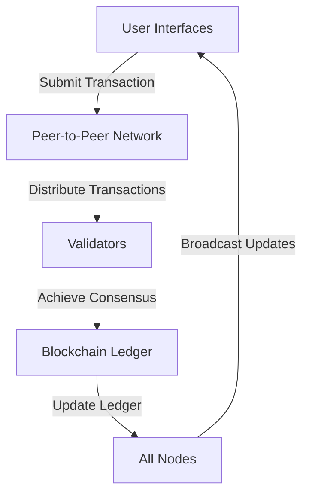
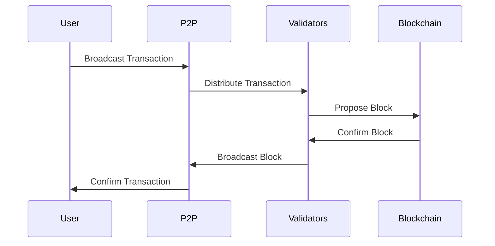

# High-Performance Decentralized Permissionless System

## Overview

This document details the design and architecture of a **high-performance decentralized permissionless system** that prioritizes scalability, security, and openness. The system enables secure, transparent, and efficient peer-to-peer interactions without a central authority, making it suitable for applications such as decentralized finance (DeFi), distributed storage, content delivery networks, and beyond.

The architecture is modular, adaptable, and built to handle a high volume of concurrent operations, ensuring resilience in the face of failures or malicious attacks.

---

## Goals and Objectives

### Primary Objectives

1. **Decentralization**: Ensure no single point of control or failure by distributing operations and governance.
2. **Permissionlessness**: Allow any participant to join the network without requiring approval, ensuring inclusivity and global accessibility.
3. **High Performance**:
   - **Throughput**: Process thousands of transactions per second (TPS).
   - **Latency**: Ensure transactions are confirmed within seconds.
4. **Security**:
   - Protect against Sybil attacks, double spending, and data tampering.
   - Implement encryption for data privacy and secure communication.
5. **Scalability**: Seamlessly accommodate an increasing number of users, nodes, and transactions without degradation in performance.
6. **Interoperability**: Facilitate communication with other decentralized systems and legacy architectures.
7. **Transparency**: Provide verifiable, immutable transaction records for auditability and trust.

---

## Core Components

### 1. Node Types

1. **Full Nodes**:
   - Store the complete ledger and state of the network.
   - Validate all transactions and blocks.
   - Serve as the backbone of the system.
2. **Light Nodes**:
   - Store minimal state data to participate in transactions.
   - Rely on full nodes for validation and historical data.
   - Suitable for resource-constrained devices.
3. **Validator Nodes**:
   - Participate in the consensus process by proposing and validating blocks.
   - Stake assets in Proof-of-Stake (PoS) systems to secure the network.
4. **Observer Nodes**:
   - Monitor network activity and serve as interfaces for analytics and reporting without participating in consensus.

---

### 2. Consensus Mechanism

1. **Proof-of-Stake (PoS)**:
   - Validators stake a portion of their assets to participate in consensus.
   - Randomized selection ensures fairness and security.
   - Energy-efficient compared to Proof-of-Work (PoW).
2. **Delegated Proof-of-Stake (DPoS)**:
   - Community elects a small set of validators to enhance consensus speed.
   - Reduces latency by minimizing the number of participating nodes.
3. **Finality Protocol**:
   - Ensure block finality using protocols like PBFT (Practical Byzantine Fault Tolerance) or Tendermint.
4. **Optimizations**:
   - Parallel block validation.
   - Adaptive validator selection based on network load.

---

### 3. Data Structure

1. **Blockchain**:
   - Linear chain of blocks containing transaction data and cryptographic hashes for integrity.
2. **Directed Acyclic Graph (DAG)**:
   - Non-linear structure supporting asynchronous transaction validation.
   - Suitable for high-throughput use cases like IoT.
3. **Merkle Trees**:
   - Efficiently verify data integrity with minimal overhead.
   - Used for quick transaction inclusion proofs.

---

### 4. Networking Layer

1. **Peer-to-Peer (P2P) Protocol**:
   - Nodes communicate directly without intermediaries.
   - Gossip protocols ensure efficient propagation of transactions and blocks.
2. **Routing Algorithms**:
   - Kademlia DHT for distributed data storage and retrieval.
   - Optimized message routing to reduce network congestion.
3. **Security**:
   - End-to-end encryption.
   - TLS/SSL for secure connections between nodes.

---

### 5. Execution Layer

1. **Smart Contract Virtual Machine**:
   - Turing-complete environment (e.g., EVM, WASM) for decentralized application (dApp) execution.
   - Sandboxed to isolate malicious or faulty contracts.
2. **Transaction Manager**:
   - Ensures sequential execution and manages conflicts.
   - Handles gas or execution fees to prevent abuse.

---

### 6. Storage Layer

1. **On-Chain Storage**:
   - Critical metadata and state data directly stored on the ledger.
   - Immutable and tamper-proof.
2. **Off-Chain Storage**:
   - Distributed systems like IPFS, Arweave, or Filecoin for large data.
   - Reduces on-chain bloat and enhances scalability.

---

## Workflow: Transaction Lifecycle

1. **Transaction Creation**:
   - A user signs a transaction using their private key.
   - The signed transaction includes metadata such as sender, recipient, value, and timestamp.
2. **Broadcasting**:
   - The transaction is sent to the network using P2P protocols.
   - Light nodes forward transactions to full nodes.
3. **Validation**:
   - Full nodes validate transaction integrity, digital signatures, and available balances.
   - Validators reach consensus on including the transaction in a block.
4. **Block Proposal**:
   - A validator proposes a block containing validated transactions.
   - Other validators review and vote on the block.
5. **Finalization**:
   - Once consensus is achieved, the block is appended to the blockchain.
   - Transaction state is updated, and the block is broadcast to the network.
6. **Confirmation**:
   - Users receive confirmation of the transaction's inclusion in the ledger.

---

## Advanced Features

### 1. Sharding

- Splits the network into smaller partitions (shards) that process transactions in parallel.
- Reduces computational and storage load on individual nodes.
- Employs a beacon chain to coordinate cross-shard communication.

### 2. Layer 2 Scaling

1. **State Channels**:
   - Enable off-chain transactions with periodic on-chain settlement.
2. **Rollups**:
   - Batch multiple transactions into a single on-chain transaction using zero-knowledge proofs.

### 3. Incentives

- Validators are rewarded for securing the network (staking rewards, transaction fees).
- Users pay fees proportional to transaction complexity and size.

### 4. Governance

- On-chain voting enables protocol upgrades and feature additions.
- Community proposals ensure inclusive decision-making.

### 5. Security

1. **Sybil Resistance**:
   - Economic barriers like staking prevent malicious actors from dominating the network.
2. **Consensus Finality**:
   - Protocols like PBFT ensure transaction irreversibility.

---

## System Diagrams

### Logical Architecture

```
+----------------------------+
|       Application Layer    |
|  - User Interfaces (UI)    |
|  - Decentralized Apps      |
+----------------------------+
            |
+----------------------------+
|    Smart Contract Layer    |
|  - Virtual Machine         |
|  - Contract Execution      |
+----------------------------+
            |
+----------------------------+
|       Consensus Layer      |
|  - Validator Selection     |
|  - PoS/DPoS Mechanisms     |
+----------------------------+
            |
+----------------------------+
|     Networking Layer       |
|  - P2P Protocols           |
|  - Routing Mechanisms      |
+----------------------------+
            |
+----------------------------+
|        Storage Layer       |
|  - On-Chain & Off-Chain    |
|  - IPFS, Arweave           |
+----------------------------+
```

### Logical Architecture



### Transaction Flow


---

## Challenges and Solutions

### Challenges

1. **Scalability**: Increased users and transactions strain resources.
   - **Solution**: Sharding, Layer 2 scaling, and efficient consensus.
2. **Security**: Risk of malicious actors and network attacks.
   - **Solution**: PoS-based Sybil resistance, encryption, and distributed governance.
3. **Energy Efficiency**: Excessive resource consumption in consensus.
   - **Solution**: Transition from PoW to PoS or DPoS.

---

## Future Enhancements

1. **AI Integration**:
   - Predict transaction patterns to optimize performance.
   - Enhance fraud detection.
2. **Cross-Chain Interoperability**:
   - Build bridges to connect with other networks.
3. **Privacy Features**:
   - Incorporate zero-knowledge proofs for anonymous transactions.

---

This document provides a robust foundation for designing, developing, and scaling a **high-performance decentralized permissionless system** while addressing real-world challenges and requirements.
